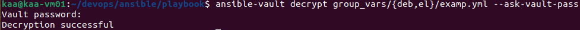
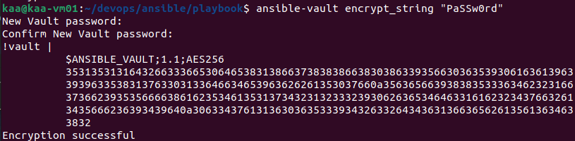

### Домашнее задание к занятию "08.01 Введение в Ansible"

### Подготовка к выполнению
1. Установил ansible версии 2.10:

   

2. Создал свой собственный публичный репозиторий на github с произвольным именем

   [https://github.com/crursus/devops-netology/tree/main/homeworks/08-ansible-01-base](https://github.com/crursus/devops-netology/tree/main/homeworks/08-ansible-01-base)

3. Скачал [playbook](./playbook/) из репозитория с домашним заданием и перенёс его в свой репозиторий.
---
### Основная часть
1. Запустил playbook `site.yml` на окружении из `test.yml`.
   * ```shell
      ansible-playbook -i inventory/test.yml site.yml
     ```
   * Значение факта `some_fact` при выполнении playbook'a `12`:
   
   

2. Нашёл файл с переменными `group_vars\all\examp.yml` в котором задаётся найденное в первом пункте значение и поменял его на 'all default fact':

   

3. Подготовил собственное окружение для проведения дальнейших испытаний:
   ```shell
      sudo groupadd docker
      sudo usermod -aG docker $USER 
      reboot
      sudo docker run --name centos7 -d centos:7 sleep infinity
      sudo docker run --name ubuntu -d pycontrib/ubuntu:latest sleep infinity
   ```
   
   

4. Провёл запуск playbook на окружении из `prod.yml`. 

   * ```shell
      ansible-playbook -i inventory/prod.yml site.yml
     ```
   * Зафиксировал полученные значения `some_fact` для каждого из `managed host`:
   
   

5. Добавил факты в `group_vars` каждой из групп хостов так, чтобы для `some_fact` получились следующие значения: для `deb` - 'deb default fact', для `el` - 'el default fact'.
6. Повторил запуск playbook на окружении `prod.yml`. Убедился, что выдаются корректные значения для всех хостов:

   

7. При помощи `ansible-vault` зашифруйте факты в `group_vars/deb` и `group_vars/el` с паролем `netology`.

   ```shell
      ansible-vault encrypt group_vars/{deb,el}/examp.yml
   ```

8. Запустил playbook на окружении `prod.yml`. При запуске `ansible` запрашивает пароль. Убедился в работоспособности:

   ```shell
      ansible-playbook -i inventory/prod.yml site.yml --ask-vault-pass
   ```

9. Посмотрел при помощи `ansible-doc` список плагинов для подключения. Выбрал подходящий для работы на `control node` - `local`:

   ```shell
      ansible-doc -t connection -l
      ansible-doc -t connection local
   ```
   

10. В `prod.yml` добавил новую группу хостов с именем `local`, в ней разместите localhost с необходимым типом подключения.
11. Запустил playbook на окружении `prod.yml`. При запуске `ansible` запросил пароль. Убедился что факты `some_fact` для каждого из хостов определены из верных `group_vars`:
   
   

12. Ответил на вопросы:

| №п.п | Вопрос                                                                                                                                      | Ответ                                             |
|------|---------------------------------------------------------------------------------------------------------------------------------------------|---------------------------------------------------|
| 1    | Где расположен файл с `some_fact` из второго пункта задания?                                                                                | `group_vars\all\examp.yml`                        |
| 2    | Какая команда нужна для запуска вашего `playbook` на окружении `test.yml`?                                                                  | `ansible-playbook -i inventory/test.yml site.yml` |
| 3    | Какой командой можно зашифровать файл?                                                                                                      | `ansible-vault encrypt`                           |
| 4    | Какой командой можно расшифровать файл?                                                                                                     | `ansible-vault decrypt`                           |
| 5    | Можно ли посмотреть содержимое зашифрованного файла без команды расшифровки файла? Если можно, то как?                                      | `ansible-vault view`                              |
| 6    | Как выглядит команда запуска `playbook`, если переменные зашифрованы?                                                                       | `ansible-playbook --ask-vault-pass`               |
| 7    | Как называется модуль подключения к host на windows?                                                                                        | `winrm`                                           |
| 8    | Приведите полный текст команды для поиска информации в документации ansible для модуля подключений ssh                                      | `ansible-doc -t connection ssh`                   |
| 9    | Какой параметр из модуля подключения `ssh` необходим для того, чтобы определить пользователя, под которым необходимо совершать подключение? | `- remote_user`                                   |


Привожу ссылку на мой открытый репозиторий с изменённым `playbook` и заполненным `README.md`: [https://github.com/crursus/devops-netology/tree/main/homeworks/08-ansible-01-base](https://github.com/crursus/devops-netology/tree/main/homeworks/08-ansible-01-base)

## Необязательная часть

1. При помощи `ansible-vault` расшифровал все зашифрованные файлы с переменными:

   ```shell
      ansible-vault decrypt group_vars/* --ask-vault-pass
   ```
   

2. Зашифровал отдельное значение `PaSSw0rd` для переменной `some_fact` паролем `netology`. Добавил полученное значение в `group_vars/all/exmp.yml`:

   ```shell
      ansible-vault encrypt_string "PaSSw0rd"
   ```
   

3. Запустил `playbook`, убедился, что для нужных хостов применился новый `fact`:

   

4. Добавил новую группу хостов `fedora`, переменная `rh`. В качестве образа использовал [этот](https://hub.docker.com/r/pycontribs/fedora):
5. Написал скрипт на bash (автоматизировал поднятие необходимых контейнеров, запуск ansible-playbook и остановку контейнеров):

   ```shell
      #!/usr/local/env bash
      docker-compose up -d
      ansible-playbook -i inventory/prod.yml site.yml --ask-vault-pass
      docker-compose down
   ```
   Выполнил скрипт:
   ```shell
      kaa@kaa-vm01:~/devops/ansible/playbook$ bash run.sh 
      Creating network "playbook_default" with the default driver
      Creating fedora  ... done
      Creating ubuntu  ... done
      Creating centos7 ... done
      Vault password: 
      
      PLAY [Print os facts] **************************************************************************************************************************************************************************************
      
      TASK [Gathering Facts] *************************************************************************************************************************************************************************************
      ok: [localhost]
      ok: [fedora]
      [DEPRECATION WARNING]: Distribution Ubuntu 18.04 on host ubuntu should use /usr/bin/python3, but is using /usr/bin/python for backward compatibility with prior Ansible releases. A future Ansible release 
      will default to using the discovered platform python for this host. See https://docs.ansible.com/ansible/2.10/reference_appendices/interpreter_discovery.html for more information. This feature will be 
      removed in version 2.12. Deprecation warnings can be disabled by setting deprecation_warnings=False in ansible.cfg.
      ok: [ubuntu]
      ok: [centos7]
      
      TASK [Print OS] ********************************************************************************************************************************************************************************************
      ok: [localhost] => {
          "msg": "Ubuntu"
      }
      ok: [centos7] => {
          "msg": "CentOS"
      }
      ok: [ubuntu] => {
          "msg": "Ubuntu"
      }
      ok: [fedora] => {
          "msg": "Fedora"
      }
      
      TASK [Print fact] ******************************************************************************************************************************************************************************************
      ok: [localhost] => {
          "msg": "PaSSw0rd"
      }
      ok: [centos7] => {
          "msg": "el default fact"
      }
      ok: [ubuntu] => {
          "msg": "deb default fact"
      }
      ok: [fedora] => {
          "msg": "rh default fact"
      }
      
      PLAY RECAP *************************************************************************************************************************************************************************************************
      centos7                    : ok=3    changed=0    unreachable=0    failed=0    skipped=0    rescued=0    ignored=0   
      fedora                     : ok=3    changed=0    unreachable=0    failed=0    skipped=0    rescued=0    ignored=0   
      localhost                  : ok=3    changed=0    unreachable=0    failed=0    skipped=0    rescued=0    ignored=0   
      ubuntu                     : ok=3    changed=0    unreachable=0    failed=0    skipped=0    rescued=0    ignored=0   
      
      Stopping centos7 ... done
      Stopping ubuntu  ... done
      Stopping fedora  ... done
      Removing centos7 ... done
      Removing ubuntu  ... done
      Removing fedora  ... done
      Removing network playbook_default
      
   ```

6. Все изменения должны быть зафиксированы и отправлены в личный репозиторий.


