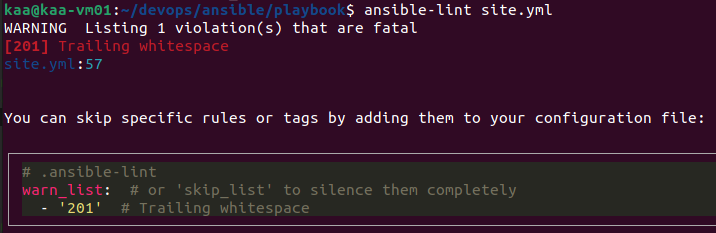
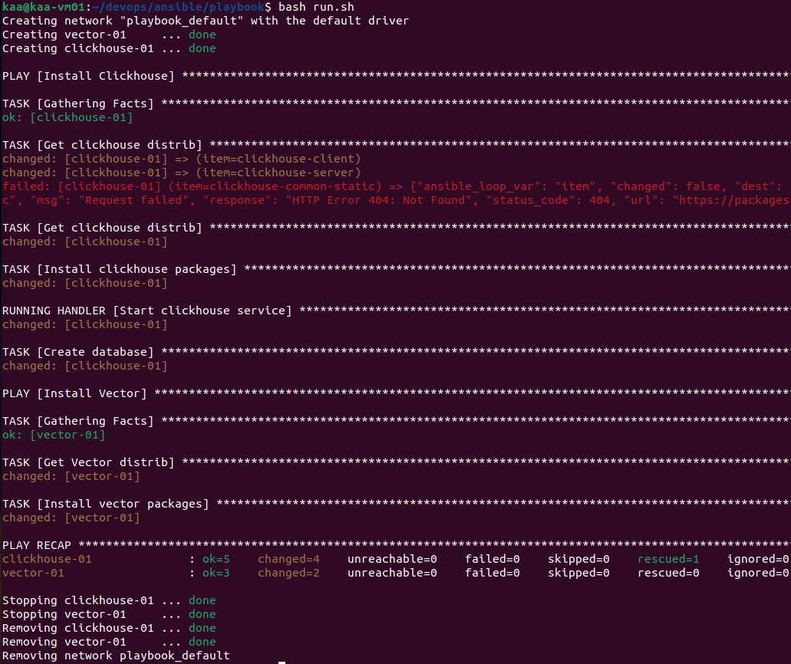
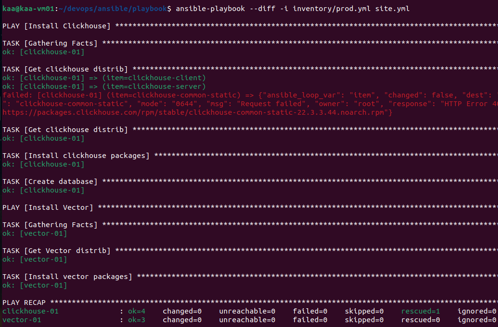
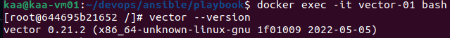

### Домашнее задание к занятию "08.02 Работа с Playbook"

#### Подготовка к выполнению

1. Использовал [свой](https://github.com/crursus/devops-netology/tree/main/homeworks/08-ansible-02-playbook) старый публичный репозиторий на github.
2. Скачал playbook из репозитория с домашним заданием и перенёс его в свой репозиторий.
3. Подготовил хосты в соответствии с группами из представленного playbook.

#### Основная часть

1. Приготовил inventory файл `prod.yml`.
2. Дописал playbook, выполняет ещё один play: скачивает нужную версию дистрибутива, устанавливает [vector](https://vector.dev).
3. Запустил `ansible-lint site.yml` и исправил одну ошибку:
    
4. Запустил playbook на этом окружении с флагом `--check`.
    
5. Запустил playbook на `prod.yml` окружении с флагом `--diff`. Убедился, что изменения на системе произведены.
6. Повторно запустите playbook с флагом `--diff` и убедился, что playbook идемпотентен.
    
7. Подготовил описание по своему playbook:
    * Выполняет скачивание пакетов clickhouse: clickhouse-client, clickhouse-server
    * Скачивает `clickhouse-common-static` так как не произошло скачивание в предыдущей группе
    * Устанавливает пакеты clickhouse
    * Запускает сервис clickhouse
    * Создаёт БД
    * Выполняет скачивание пакета vector
    * Устанавливает пакет vector
   
      
    * Создаёт файл шаблона (Тест)
8. Готовый playbook выложил в свой репозиторий, поставил тег `08-ansible-02-playbook` на фиксирующий коммит, предоставляюссылку на него.

