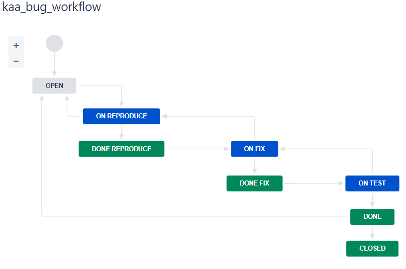
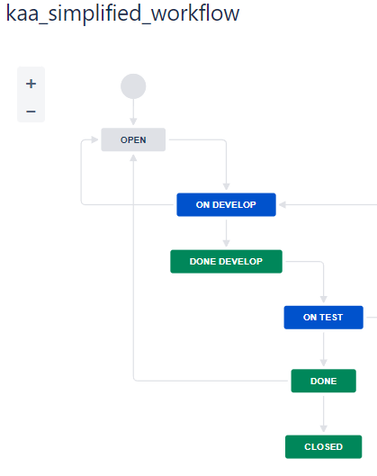

### Домашнее задание к занятию "09.01 Жизненный цикл ПО"

### Подготовка к выполнению
1. Получил бесплатную [JIRA](https://www.atlassian.com/ru/software/jira/free)
2. Настроил её для своей "команды разработки"
3. Создать доски kanban и scrum

### Основная часть
  1. В рамках основной части создал собственные workflow для двух типов задач: 
    * bug
    * остальные типы задач(simplified) 

Задачи типа bug проходят следующий жизненный цикл:
  1. Open -> On reproduce
  1. On reproduce -> Open, Done reproduce
  1. Done reproduce -> On fix
  1. On fix -> On reproduce, Done fix
  1. Done fix -> On test
  1. On test -> On fix, Done
  1. Done -> Closed, Open

Остальные задачи проходят по упрощённому workflow:
  1. Open -> On develop
  2. On develop -> Open, Done develop
  3. Done develop -> On test
  4. On test -> On develop, Done
  5. Done -> Closed, Open

Создал задачу с типом bug, провёл его по всему workflow до Done. Создал задачу с типом epic, к ней привязал несколько задач с типом task, провёл их по всему workflow до Done. При проведении обеих задач по статусам использовал kanban. Вернул задачи в статус Open.
Перешёл в scrum, запланировал новый спринт, состоящий из задач эпика и одного бага, стартовал спринт, провёл задачи до состояния Closed. Закрыл спринт.

Всё отработало в рамках ожидания - выгрузил схемы workflow для импорта в XML. Файлы с workflow прикладываю к решению задания: [XML](workflow_schema/)